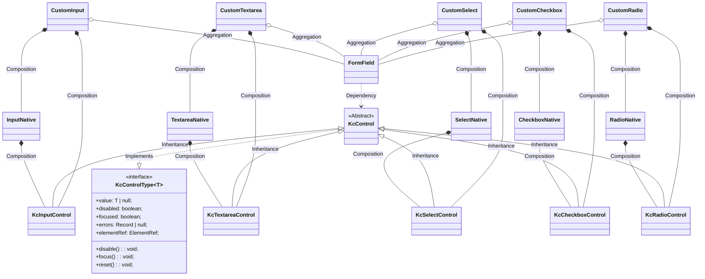

# K5cjs

This project was generated with [Angular CLI](https://github.com/angular/angular-cli) version 13.2.4.

```mermaid
classDiagram
  class KcControl {
    <<Abstract>>
  }

  class KcControlType~T~{
    <<interface>>

    +value: T | null;

    +disabled: boolean;
    +disable(): void;

    +focused: boolean;
    +focus(): void;

    +reset(): void;

    +errors: Record<string, unknown> | null;

    +elementRef: ElementRef<T>;
  }

  class KcInputControl { }
  class KcCheckboxControl { }
  class KcRadioControl { }

  class CustomInput { }
  class CustomTextarea { }
  class CustomSelect { }
  class CustomCheckbox { }
  class CustomRadio { }

  class InputNative { }
  class TextareaNative { }
  class SelectNative { }
  class CheckboxNative { }
  class RadioNative { }

  class FormField { }

  InputNative *-- KcInputControl : Composition
  TextareaNative *-- KcTextareaControl : Composition
  SelectNative *-- KcSelectControl : Composition
  CheckboxNative *-- KcCheckboxControl : Composition
  RadioNative *-- KcRadioControl : Composition

  KcControl ..|> KcControlType : Implements
  FormField ..> KcControl : Dependency

  KcControl <|-- KcInputControl : Inheritance
  KcControl <|-- KcTextareaControl : Inheritance
  KcControl <|-- KcSelectControl : Inheritance
  KcControl <|-- KcCheckboxControl : Inheritance
  KcControl <|-- KcRadioControl : Inheritance

  CustomInput *-- KcInputControl : Composition
  CustomInput *-- InputNative : Composition
  CustomInput o-- FormField : Aggregation

  CustomTextarea *-- KcTextareaControl : Composition
  CustomTextarea *-- TextareaNative : Composition
  CustomTextarea o-- FormField : Aggregation

  CustomSelect *-- KcSelectControl : Composition
  CustomSelect *-- SelectNative : Composition
  CustomSelect o-- FormField : Aggregation

  CustomCheckbox *-- KcCheckboxControl : Composition
  CustomCheckbox *-- CheckboxNative : Composition
  CustomCheckbox o-- FormField : Aggregation

  CustomRadio *-- KcRadioControl : Composition
  CustomRadio *-- RadioNative : Composition
  CustomRadio o-- FormField : Aggregation
```
